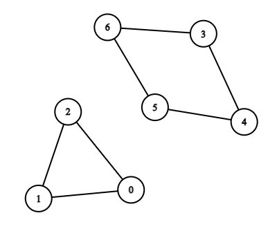

# Shortest Cycle in a Bi-Directional Graph

This repository contains a Python algorithm to find the length of the shortest cycle in a bi-directional graph.

## Problem Description

There is a bi-directional graph with `n` vertices, where each vertex is labeled from 0 to `n - 1`. The edges in the graph are represented by a given 2D integer array `edges`, where `edges[i] = [ui, vi]` denotes an edge between vertex `ui` and vertex `vi`. Every vertex pair is connected by at most one edge, and no vertex has an edge to itself.

The goal is to return the length of the shortest cycle in the graph. If no cycle exists, the algorithm should return -1.

A cycle is defined as a path that starts and ends at the same node, and each edge in the path is used only once.

## Example 1



**Input**:
```python
n = 7
edges = [[0,1],[1,2],[2,0],[3,4],[4,5],[5,6],[6,3]]
```

**Output**: `3`

Explanation: The cycle with the smallest length is: 0 -> 1 -> 2 -> 0.

## Example 2


**Input**:
```python
n = 4
edges = [[0,1],[0,2]]
```

**Output**: `-1`

Explanation: There are no cycles in this graph.

## Constraints

- 2 <= n <= 1000
- 1 <= edges.length <= 1000
- edges[i].length == 2
- 0 <= ui, vi < n
- ui != vi
- There are no repeated edges.